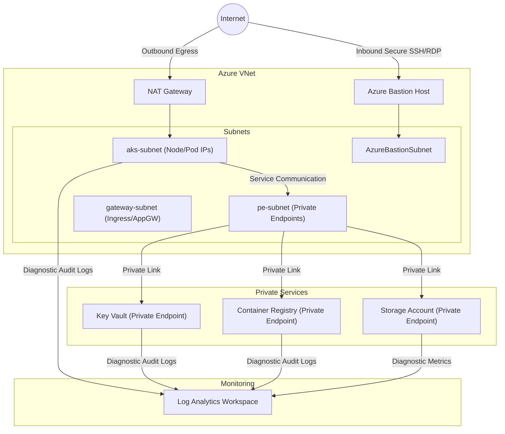
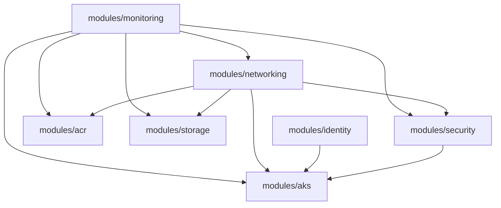

# Production-Grade Azure AKS Landing Zone (Terraform)

This repository contains the complete, production-ready, modular Terraform code for deploying a secure, resilient, and enterprise-scale Azure Kubernetes Service (AKS) Landing Zone. It conforms to the Microsoft Cloud Adoption Framework (CAF) principles and is designed to host microservices platforms in a zero-trust model.

---Refarence
terraform init -backend-config=environments/dev/backend.tfvars
terraform init -migrate-state
terraform init -backend-config=environments/dev/backend.tfvars
terraform plan -var-file=environments/dev/terraform.tfvars -out=tfplan
terraform init -reconfigure -backend-config=environments/dev/backend.tfvars
terraform plan -var-file=environments/dev/terraform.tfvars -out=tfplan
terraform init -reconfigure -backend-config=environments/dev/backend.tfvars
terraform plan -var-file=environments/dev/terraform.tfvars -out=tfplan
terraform init -reconfigure -backend-config=environments/dev/backend.tfvars
terraform plan -var-file=environments/dev/terraform.tfvars -out=tfplan
terraform apply tfplan
terraform plan -var-file=environments/dev/terraform.tfvars -out=tfplan
terraform apply tfplan

## Architecture Overview

Detailed design documentation and interactive diagrams are available directly in this repository:
* **Project Documentation**: [project_document.md](file:///Users/subdebna/InfraPipeline/AzureLandingzoneForAKS/project_document.md)
* **Detailed Design Document**: [architecture_design.md](file:///Users/subdebna/InfraPipeline/AzureLandingzoneForAKS/architecture_design.md)
* **Draw.io Editable Diagram**: [architecture_design.drawio](file:///Users/subdebna/InfraPipeline/AzureLandingzoneForAKS/architecture_design.drawio) (Open this file in [draw.io](https://app.diagrams.net/) to edit the architecture layout)


The landing zone is designed using a hub-and-spoke subnet architecture within a single virtual network (extendable to a global hub-spoke model). It enforces network isolation, least-privilege identity, and comprehensive auditing.


### Infrastructure Architecture



### Core Architecture Features:
1. **Network Security**:
   - **Private AKS API Server**: Direct access to the control plane is completely blocked from the public internet. Access is routed internally via Private Link and DNS integration.
   - **Egress Isolation**: Outbound internet traffic from AKS nodes is routed through a managed **NAT Gateway** with a dedicated public IP, preventing node IP exposure and SNAT port exhaustion.
   - **Ingress Isolation**: Provisioned subnets for Application Gateway/NGINX Ingress Controller.
   - **Private Link PaaS**: Azure Key Vault, Azure Container Registry, and Storage Account disable public networking and use **Private Endpoints** inside the dedicated `pe-subnet`.
   - **Azure Bastion**: Safe administrative ingress path without public SSH ports exposed on VM nodes.

2. **Security & Identity**:
   - **Managed Identities**: AKS uses distinct User Assigned Managed Identities for the cluster control plane and the agent pools (Kubelet), separating responsibilities.
   - **Entra ID (Azure AD) Integrated RBAC**: Control plane authorization uses Azure AD Groups instead of static kubeconfig certificates.
   - **Workload Identity (OIDC)**: Pods authenticate to Azure resources (like Key Vault or databases) using standard service accounts exchanging OpenID Connect (OIDC) tokens, eliminating static client secrets.
   - **Key Vault CSI Secret Store**: Vault secrets are mounted directly as files in pods, supporting automatic rotation.
   - **Defender for Containers**: Configured diagnostic routing to monitor runtime container threats.

---

## Directory Structure

```
AzureLandingzoneForAKS/
├── README.md                      # This documentation
├── backend.tf                     # Remote state configuration block
├── providers.tf                   # Terraform version and providers definition
├── main.tf                        # Root orchestration file calling modules
├── variables.tf                   # Global input variables definitions
├── outputs.tf                     # Unified output variables
├── locals.tf                      # Global tags and CAF-aligned naming conventions
├── environments/                  # Environment-specific configuration values
│   ├── dev/
│   │   ├── backend.tfvars         # Dev storage account state variables
│   │   └── terraform.tfvars       # Dev environment variables
│   ├── qa/
│   │   ├── backend.tfvars
│   │   └── terraform.tfvars
│   └── prod/
│       ├── backend.tfvars
│       └── terraform.tfvars
├── modules/                       # Reusable infrastructure submodules
│   ├── networking/                # VNet, subnets, Bastion, Private DNS, RT, and NAT GW
│   ├── security/                  # Private Key Vault and Private Endpoints
│   ├── monitoring/                # Log Analytics Workspace and Container Insights
│   ├── identity/                  # Managed Identities
│   ├── acr/                       # Premium Azure Container Registry
│   ├── storage/                   # Storage Account (Blob)
│   └── aks/                       # Private AKS Cluster & additional Node Pools
```

---

## Module Dependency Design

The modular structure enforces a strict, acyclic dependency model:



- **`monitoring`**: Deployed first to configure the Log Analytics Workspace.
- **`networking`**: Provisioned next to construct the VNet, Subnets, and Private DNS Zones. Subnet and Private DNS Zone resource IDs are passed as variables to the dependent PaaS modules.
- **`identity`**: Created in parallel to output Client/Principal IDs before the AKS cluster initializes.
- **`security` / `acr` / `storage`**: Deployed using the subnet inputs from the networking outputs.
- **`aks`**: Deployed last, binding to the AKS subnet, identities, Key Vault, and ACR.
- **Role Assignments (Cross-Resource)**: Declared at the **root level** in `main.tf` to avoid circular references and keep module boundaries clean.

---

## Deployment Instructions

### Prerequisites
- Install [Terraform](https://developer.hashicorp.com/terraform/downloads) (`>= 1.5.0` required).
- Install [Azure CLI](https://learn.microsoft.com/en-us/cli/azure/install-azure-cli).
- An active Azure Subscription.
- Azure AD Admin/Owner permissions (to assign roles).

### 1. Bootstrap Remote Terraform State Storage
Run the following Azure CLI commands to create a resource group and storage account for your remote backend:

```bash
# Set variables
RESOURCE_GROUP_NAME="REVA-RACE-PROJECT-ACCESS"
STORAGE_ACCOUNT_NAME="devopsracerevaprodccloud" # Must be lowercase and globally unique
CONTAINER_NAME="tfstate"
LOCATION="eastus2"

# Create Resource Group
az group create --name $RESOURCE_GROUP_NAME --location $LOCATION

# Create Storage Account
az storage account create --resource-group $RESOURCE_GROUP_NAME --name $STORAGE_ACCOUNT_NAME --sku Standard_LRS --encryption-services blob

# Create Blob Container
az storage container create --name $CONTAINER_NAME --account-name $STORAGE_ACCOUNT_NAME
```

### 2. Local Deployment Steps
To initialize, plan, and apply the infrastructure for the **dev** environment locally:

```bash
# 1. Login to Azure
az login

# 2. Set target subscription
az account set --subscription "<your-subscription-id>"

# 3. Initialize Terraform with the dev backend configuration
terraform init -backend-config=environments/dev/backend.tfvars

# 4. Generate and inspect execution plan
terraform plan -var-file=environments/dev/terraform.tfvars -out=tfplan

# 5. Apply the execution plan
terraform apply tfplan
```

### 3. Azure for Students / Cost & Quota Optimization
By default, the `dev` environment is configured with `azure_for_student = true` in [terraform.tfvars](file:///Users/subdebna/InfraPipeline/AzureLandingzoneForAKS/environments/dev/terraform.tfvars).

This toggles the deployment into a lightweight, cost-optimized, and quota-friendly mode designed to fit within Azure for Students subscription constraints (4 vCPUs quota, $100 credits limit):
* **Public Cluster**: Disables private cluster and makes the AKS API server public so you don't need a Bastion Host.
* **Bastion & NAT Gateway**: Disabled by default to prevent high hourly charges.
* **Single Node Pool**: Overrides the system node size to `Standard_B2s` (2 vCPUs) and count to `1`, and disables the secondary user node pool to stay under the 4 vCPU regional limit. System and user workloads run on the same node.
* **Basic PaaS SKUs**: Downgrades ACR to `Basic` and Key Vault to `standard`.
* **No Private Endpoints**: Disables private endpoints and DNS zones for ACR, Key Vault, and Storage.
* **Entra ID Fallback**: Disables Entra ID RBAC integration and falls back to standard Kubernetes RBAC with local accounts to avoid tenant/directory permission issues.

If you are deploying to a standard enterprise subscription and want the full, production-grade zero-trust landing zone (Private Link, Bastion, Premium ACR, multi-node pools), set this variable to `false` in [terraform.tfvars](file:///Users/subdebna/InfraPipeline/AzureLandingzoneForAKS/environments/dev/terraform.tfvars):
```hcl
azure_for_student = false
```

### 4. Accessing the AKS Cluster

#### In Student Mode (`azure_for_student = true`):
Since the AKS API server is public, you can connect directly from your local machine:
```bash
# 1. Retrieve the credentials
az aks get-credentials --resource-group rg-contoso-dev-aks-lz --name aks-contoso-dev-cluster

# 2. Test connection
kubectl get nodes
```

#### In Enterprise Mode (`azure_for_student = false`):
Since the API server is private, you must route access internally (e.g., through Azure Bastion):
1. Connect via **Azure Bastion** to a VM running inside the VNet:
   ```bash
   az network bastion tunnel --name "bas-contoso-dev" --resource-group "rg-contoso-dev-aks-lz" --target-resource-id "/subscriptions/<sub-id>/resourceGroups/<rg-name>/providers/Microsoft.Compute/virtualMachines/<vm-name>" --port 5022 --remote-port 22
   ```
2. Retrieve the cluster credentials on the Bastion proxy VM:
   ```bash
   az aks get-credentials --resource-group rg-contoso-dev-aks-lz --name aks-contoso-dev-cluster
   ```


---

## Enterprise Best Practices

- **Zero Hardcoded Secrets**: Secrets are pulled dynamically from the Azure Key Vault CSI Secrets Provider.
- **Microsegmentation**: Using Azure CNI Overlay with Network Policies enables strict container network segmentation. Pods cannot communicate with other namespaces unless explicitly allowed via a `NetworkPolicy`.
- **Infrastructure Auditing**: Diagnostic Logs are enabled for the API Server, Audit Logs, Key Vault access logs, and ACR registry logins, forwarding everything to a central Log Analytics workspace.
- **Workload Identity**: Employs Azure AD Workload Identity to avoid managing static service account credentials inside the cluster.

---

## Cost Optimization Recommendations

1. **System Node Pool Sizing**:
   - The system node pool only runs Kubernetes system services (CoreDNS, Metrics Server, etc.). Do not run application workloads on this pool.
   - Use standard cost-effective virtual machines (e.g., `Standard_D2s_v5` or `Standard_D4s_v5`) and limit the size to 2-3 nodes.
2. **User Node Pools Auto-scaling**:
   - Enable the cluster auto-scaler on all user node pools (`enable_auto_scaling = true`). Set `min_count` to the minimum viable density (e.g. 1 in dev, 3 in prod) to scale down to zero/minimum when idle.
3. **Spot Instances (for Dev/QA)**:
   - For Dev/QA workloads, configure secondary user node pools to use **Spot instances** with a max price constraint to save up to 90% compared to pay-as-you-go.
4. **Log Analytics Retention**:
   - Limit retention days to `30` in Dev/QA environments. In Prod, retain logs for `90` days or export them to a cool/archive tier storage account for compliance requirements.
5. **Azure Container Registry (ACR) Cleanups**:
   - Implement ACR retention policies and delete untagged manifest images regularly to save storage costs.


